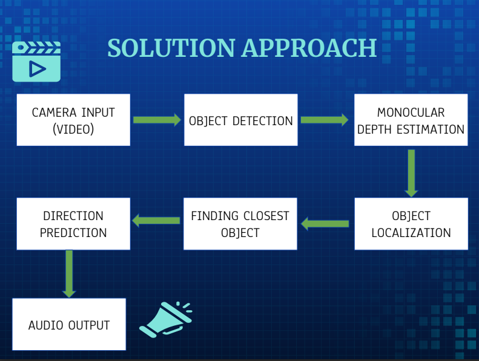
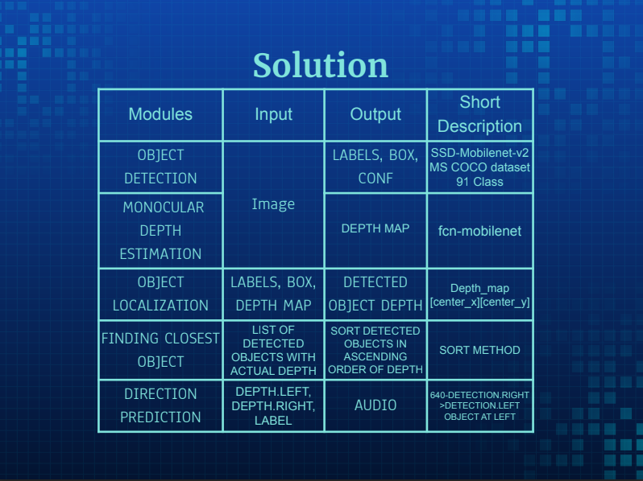
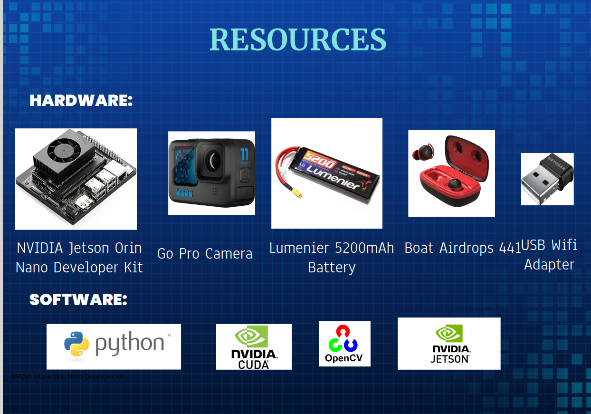
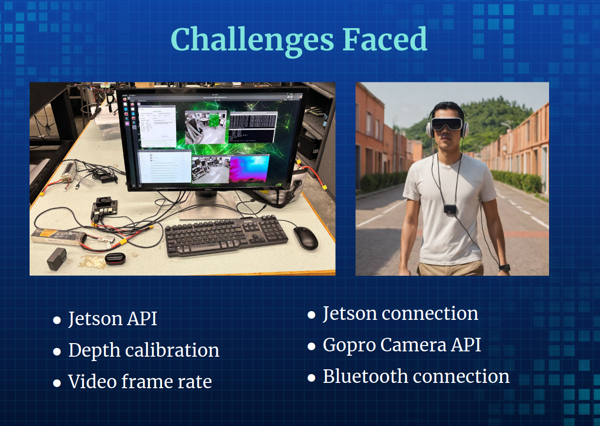
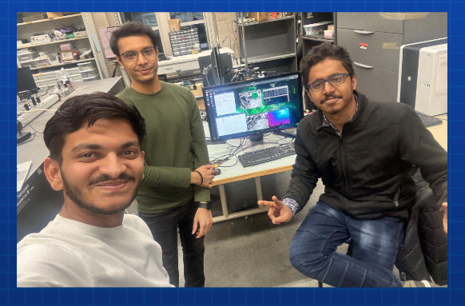

# Visual-Cognition-Assistive-System

- Drive link for demo [Link](https://drive.google.com/drive/folders/1DzeEDx6WoncPUCoLusl77xMLQFW63AB0?usp=drive_link)
- We used Jetson Inference
- Please refer to the Custom folder for the modified code
- Execute the go pro keep alive python file if your camera is gopro otherwise make necessary changes to the FinalDetection.py file to use your own usb camera. Also, please refer to the jetson page for more options
- This project was a part of Robot Vision Course (University of Minnesota, twin cities)
### Team Members
- ABHISHEK CHAUDHARI
- SUJEENDRA RAMESH
- SWAPNIL PURANIK

<video width="320" height="240" controls>
  <source src="Final_video.mp4" type="video/mp4">
</video>

  
